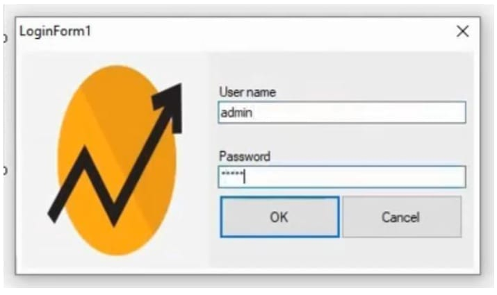
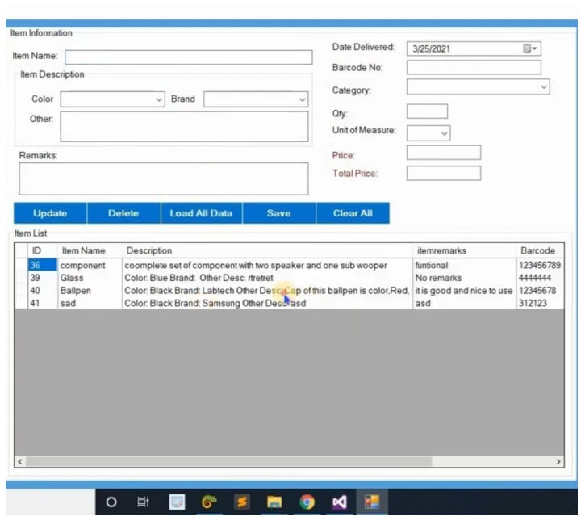
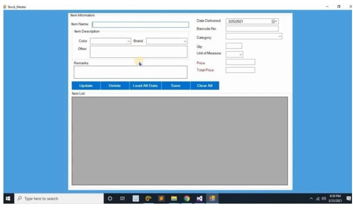
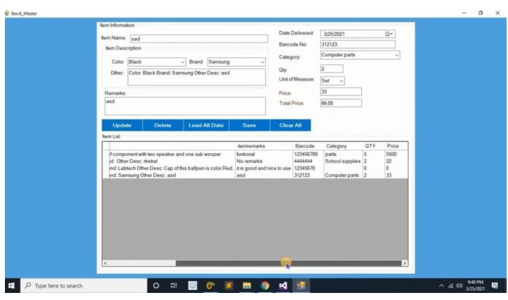
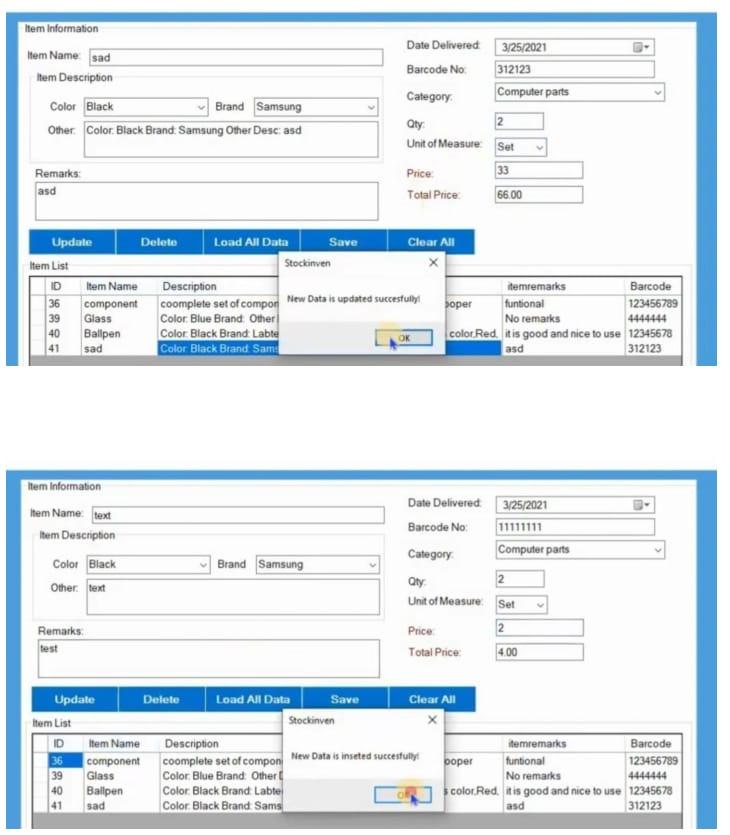

# Stock Management System

A desktop-based Stock Management System developed as a B.Sc. Computer Science academic project.

## 📌 Project Overview

The Stock Management System is designed to help manage inventory records in a computerized environment. It allows users to add, view, update, and delete stock information through a user-friendly interface.

The application was developed using VB.NET as the front end and MS Access as the back end.

## 🛠️ Technologies Used

- VB.NET
- Microsoft Visual Studio
- MS Access
- Windows 10

## ✨ Features

- User login
- Add new stock
- Load all stock records
- Update existing stock
- Delete existing stock
- Clear input fields
- Logout
- Store and retrieve stock information from the database

## 📸 Screenshots

### Login Form

### Main Interface

### Item Details

### Adding Stock

### Sample Output

## 🗄️ Database

The application uses Microsoft Access as the database backend. The project includes tables for login information and item/stock details.

## 👨‍💻 Author

*Nithin M*

B.Sc. Computer Science Graduate
